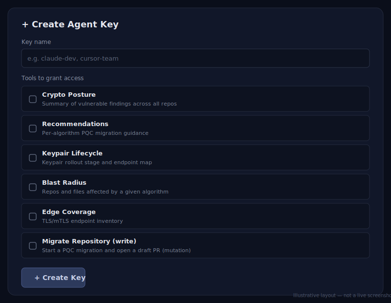

# Getting your Qryptive API key

`/qryptive-scan` always runs **fully locally** — your source code never leaves your machine,
with or without a key. An API key is only needed if you want to **sync your scan results** to
the Qryptive dashboard afterward. This is entirely optional.

## 1. Open the Agent Access page

Go to **[app.qryptive.ai/settings/agent-access](https://app.qryptive.ai/settings/agent-access)**
and sign in (or sign up — no credit card required).

## 2. Create a key



- **Key name** — anything you'll recognize later, e.g. `claude-code`.
- **Tools to grant access** — tick **any one** box. The scan-sync endpoint doesn't check which
  scope you picked, so any selection works for syncing scan results. Tick more of them if you
  also plan to use Qryptive's MCP tools (posture, recommendations, blast radius, etc.) from
  Claude Code directly.
- Click **Create Key**, then copy the value shown — it starts with `pqc_org_` and is shown
  **once**. If you lose it, just create a new one.

## 3. Export it where Claude Code's Bash tool can actually see it

```bash
export QRYPTIVE_API_KEY=pqc_org_...
```

Where you put this matters. Claude Code's Bash tool runs **non-interactive** shells for its
tool calls, so:

- ✅ **`~/.zshenv`** — sourced unconditionally by zsh, interactive or not. This works.
- ✅ **`.claude/settings.local.json`**'s `env` block — Claude-Code-native, no shell semantics
  involved:
  ```json
  {
    "env": { "QRYPTIVE_API_KEY": "pqc_org_..." }
  }
  ```
- ❌ **`~/.zshrc`** — the dotfile most people reach for by habit. It's only sourced by an
  *interactive* shell, so it will **not** be visible to Claude Code's Bash tool even after you
  `source` it and relaunch `claude`. This is the single most common setup mistake.
- ❌ Running `export ...` directly in a Claude Code prompt — doesn't persist between tool calls.

## 4. Re-run the scan

`/qryptive-scan` will sync your results after each scan from now on. If it reports "results
stayed fully local" again, re-check step 3 — that almost always means the key landed in the
wrong file.
